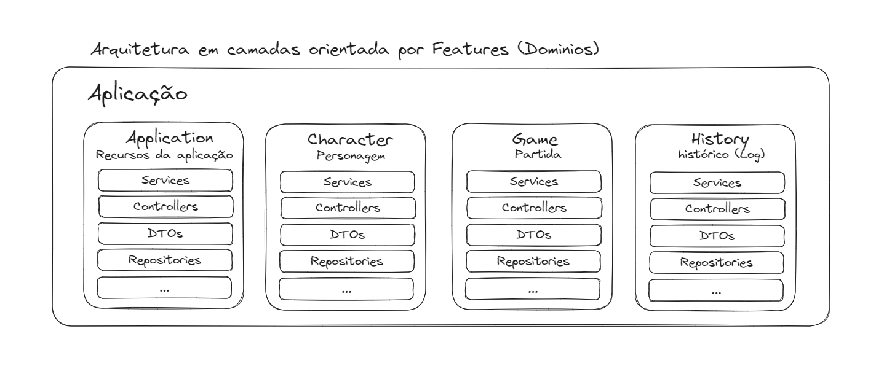

# <p style="text-align: center;">Advanced Dangeous & Dragons (AD&D) 🎲</p>

## 🔍 Sobre

Junte-se à batalha épica estilo Advanced Dangeous & Dragons (AD&D) !!

O jogo, como todo bom RPG (Role Playing Game), será duelado em turnos.
Escolha o seu nome e personagem favorito (herói ou monstro).
O seu oponente sempre será um monstro (CPU), você pode escolher ou deixar aleatório.


## 🔌 Como Executar o Projeto

Antes de começar, certifique-se de ter um ambiente com JDK 17 instalado 

Para executar o projeto, siga os seguintes passos:

1. Abra o projeto com o Editor/IDE de sua preferência


2. Faça o download das dependências do projeto. Caso seu Editor/IDE não faça automaticamente execute o comando:
    ```
       mvn dependency:copy-dependencies
    ```

3. Em seguida, você deve executar o comando:
    ```
       docker-compose up -d
    ```
   esse comando irá subir um container com o banco de dados (ele sobe na porta 50432 então certifique-se que ela esteja livre ou altere a porta  no arquivo docker-compose.yml)


4. Pronto agora é só compilar e iniciar a aplicação

## 🔌 Endpoints

A aplicação expõe uma rota com SwaggerUI (`/docs/`) para testar os endpoints 

**Characters (Personagens)** 

[`GET /characters/`](#get-characters) - Retorna todos os personagens <br/>
[`GET /characters/:id`](#get-character-id) - Retorna um personagem com base no ID <br/>
[`POST /characters/`](#post-character) - Cria um novo personagem <br/>
[`PUT /characters/:id`](#put-character) - Atualiza um personagem com base no ID <br/>
[`DELETE /characters/:id`](#delete-character) - Exclui um personagem com base no ID

**Game (Partida)**

[`POST /games/`](#post-games) - Cria um novo Jogo (Partida) <br/>
[`POST /games/:id/start`](#post-game-id-start) - Inicia um partida recém-criada <br/>
[`POST /games/:id/attack`](#post-game-id-attack) - Executa a ação de ataque no turno atual <br/>
[`POST /games/:id/defense`](#post-game-id-defense) - Executa a ação de defesa no turno atual <br/>
[`POST /games/:id/damage`](#post-game-id-damage) - Calcula e aplica o dano no turno atual <br/>
[`GET /games/:id/history`](#post-game-id-history) - Retorna o histórico (Log) de uma partida

   Obs: os endpoints relacionados ao Jogo (`/games`) são feitos para o contexto do jogador humano. As ações do oponente (CPU) são executadas automaticamente em resposta as ações do jogador

## 📏  Aquitetura e padrões utilizados 

 - [x] Design Pattern Strategy para validação de regras na camada de serviço
 - [x] Validação de payloads com Bean Validation
 - [x] Mapeamento de DTOs para Entidades com ModelMapper
 - [x] Documentação padrão OpenApi Com SpringDoc

## 💻 Tecnologias


## 👨🏽‍💻 Autor

**Lucas Mathias**

[](https://www.linkedin.com/in/lucas-mathias-729a27181/)
[](mailto:lucasmathias936@gmail.com)
